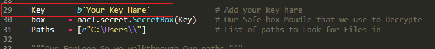

# Python-Ransomware

Complete Python RansomeWare Source Code With Full Decoumetions.

~~~
   ____ ____ _  _ ____ ____ _  _ _ _ _ ____ ____ ____  ___  _   _ 
   |__/ |__| |\ | [__  |  | |\/| | | | |__| |__/ |___  |__]  \_/  
   |  \ |  | | \| ___] |__| |  | |_|_| |  | |  \ |___ .|      |   
~~~

|About: | This is a Classic Example Of RansomWare Written in python.
|Tested On:  | Windows 10 / Windows7
|Suport :  | + Windows7
|Date of Publish :  | 10/31/2019
|Last Update :  | 11/3/2019 |

Find out about what is Ransomware [Here](https://en.wikipedia.org/wiki/Ransomware)

- Convert the `.py` to `exe` use [pyinstaller](https://www.pyinstaller.org)
- Convert `.py` File to `exe` : 

`pyinstaller --onefile -w --icon YourIcon.ico Ransomware.py`

Before Converting File to exe Run : 

`pip install --user --requirement requirements.txt`

# To Decrypt Files :

Run `python DeRansomware.py` On line 29 :

Key (example):

~~~
Key     = b"\xbd\xb6\x80'4z\x9c\xb53{\xe3\xd7\xf4\xc2\\\x08\xbd\xbb\xdb\xd6\xb2.\xfa\xe1o\x1f\xcd\x80AM\xd5>" 
~~~

OR :

~~~
Key     = b'T\xb5\xc4\x14\xe4\xa7\x18\x0b8T\xdb\xec\xf0.v>t\xce\x91w5y1\xce\xa3\x1a;J<SKD' 
~~~

Replace Key Betwen `" "` or `' '` with your own key

# Change Log

`Change_log (11/3/2019)` :

- Switching from cryptography Lib to pynacl.
- Adding Decryptor script for Batter File decryption
- Path Note: So on my research, i found out that pynacl is faster and stronger it is using <a href="https://en.wikipedia.org/wiki/Salsa20">Salsa20 stream cipher</a>
algorithm, and if your using old version I recommend  you to switch from it because This version use More secure encryption ~ More updates on the way :)

### NOTE:

THIS SOURCE CODE IS For Educational Purposes Only.
IM NOT RESBONBLE FOR ANY BAD & MALICIOUS USE OF IT.
P.S: This is just Concept and its still work in the progress
